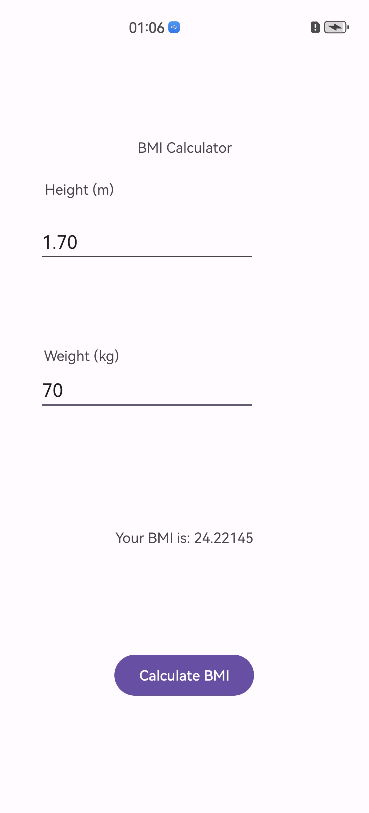

# BMI Calculator

A simple Android application to calculate Body Mass Index (BMI). This app allows users to input their height and weight to calculate their BMI and display the result.

## Features

- Input height (in meters) and weight (in kilograms).
- Calculate BMI using the formula: `BMI = weight / (height * height)`.
- Display the calculated BMI result on the screen.

## Screenshot



## Requirements

- **Android SDK**: 24 or higher
- **Compile SDK**: 35
- **Java Version**: 11

## Usage

1. Clone the repository:
   ```bash
   git clone https://github.com/Lovely-Qianyun/Android-WS1-BMI-Calculator.git
2. Open this project with Android Studio and run on remote device or physical device with developer mode and USB debugging.